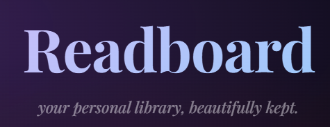
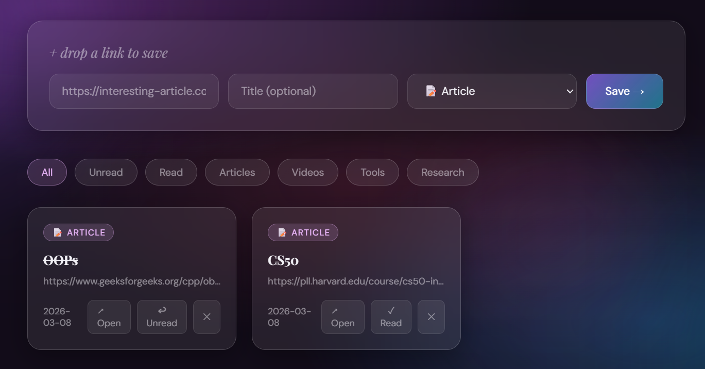

# 📚 Readboard

A beautiful glassmorphism-styled "Read Later" link board. Save links, tag them, mark them as read, and never lose an interesting article again.

**[Live Demo Link](https://readboard-seven.vercel.app/)**

## ✨ Features

- Save any link with a title and category tag
- Filter by All / Unread / Read / Category
- Mark links as read or delete them
- Stats showing total saved, read, and unread
- Data persists in your browser via localStorage
- Fully responsive — works on mobile too

## 🛠️ Built With

- HTML
- CSS (Glassmorphism design)
- Vanilla JavaScript
- Google Fonts (Playfair Display + DM Sans)
- 
## 📸 Preview

> A dark, glass-styled link board with animated background orbs, card-based layout, and smooth interactions.

